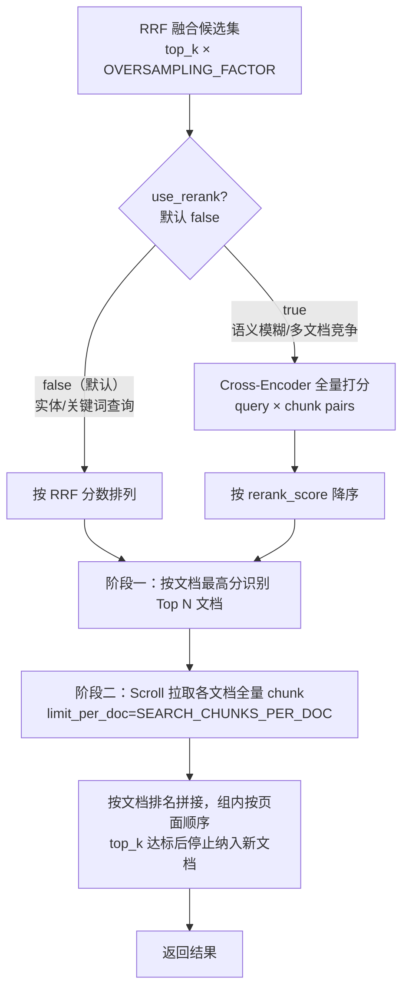

# 重排序（Rerank）设计

> 所属模块：向量检索 | 来源章节：§7-ext | [← 返回主索引](../需求文档.md)

---

## 背景与动机

混合检索（dense + sparse RRF）扩大了召回范围，但 RRF 融合分数基于排名位置而非语义相关性，**精排阶段的准确性仍有提升空间**。

重排序（Rerank）引入 Cross-Encoder 模型，对召回候选集中的每个 chunk 与查询词进行**全文对比打分**，替换 RRF 位置分数，从而提升最终返回结果的语义精度。

---

## 处理时机

系统采用**两阶段文档优先检索**，Rerank 在阶段一完成，阶段二补全文档内低分页面：

```
Dense Prefetch ──┐
                 ├──▶ RRF 融合（top_k × OVERSAMPLING_FACTOR 候选）
Sparse Prefetch ─┘
                         │
                         ▼
              ┌─ Cross-Encoder Rerank ─┐   ← 阶段一
              │  query × chunk → score │
              └───────────────────────┘
                         │
                         ▼
              按文档最高分排出 Top N 文档
                         │
                         ▼
              ┌─ Qdrant Scroll 二次拉取 ─┐  ← 阶段二
              │  按 document_id 拉全量   │
              │  chunk（含低分页面）      │
              └──────────────────────────┘
                         │
                         ▼
              按文档排名顺序拼接，组内按页面顺序排列
                         │
                         ▼
              top_k 达标后停止纳入新文档（不在文档内截断）
```

**阶段二的意义**：同一文档内评分较低的 chunk（如简历第3页），其相关性远大于其他文档的高分 chunk。阶段二直接从 Qdrant 拉取目标文档的全量 chunk，绕过候选池截断限制。

**top_k 的语义变化**：在两阶段设计中，`top_k` 控制的是"何时停止纳入新文档"，而非总 chunk 数的硬上限。因此响应 `total` 可能略大于 `top_k`，代表当前已纳入文档的全部页面均已返回。

---

## Rerank 模型选型

| 提供方 | 模型 | 部署方式 | 语言支持 | 说明 |
|--------|------|----------|----------|------|
| BAAI | `BAAI/bge-reranker-v2-m3` | sentence-transformers 本地推理 | 多语言（中英优先） | 无外网依赖，零 API 费用，适合工厂内网离线部署；首次运行自动从 HuggingFace 下载（约 1.1 GB） |

**统一使用 `BAAI/bge-reranker-v2-m3`，通过 `sentence-transformers.CrossEncoder` 进程内加载**，无需额外服务进程。模型在首次请求时懒加载，后续请求直接复用已加载实例。

> **为何不用 Ollama `/api/rerank`**：Ollama 社区上传的模型（如 `dengcao/bge-reranker-v2-m3`）为 chat 格式封装，不具备 reranker 能力；官方 `/api/rerank` 端点需要 Ollama ≥ v0.5.1 且模型 Modelfile 中声明 reranker 类型。直接使用 `sentence-transformers` 更可靠，无版本与模型配置依赖。

### 环境变量配置

| 变量 | 默认值 | 说明 |
|------|--------|------|
| `RERANKER_MODEL_PATH` | `BAAI/bge-reranker-v2-m3` | HuggingFace 模型 ID 或本地绝对路径 |
| `RERANKER_TIMEOUT_S` | `30` | 单次推理超时秒数（首次含模型加载，建议 30s） |

---

## 功能需求（ID: RAG-RERANK-001 [P1]）

📎 来源: §7 检索增强 — 精排阶段扩展

| 项目 | 内容 |
|------|------|
| 业务场景 | 用户发起语义检索或多轮问答时，系统对过采样候选块进行 cross-encoder 精排，提升最终引用内容的语义相关性 |
| 前置条件 | 混合检索已返回 `top_k × OVERSAMPLING_FACTOR` 候选 chunk；`sentence-transformers` 已安装，`RERANKER_MODEL_PATH` 可访问 |
| 默认行为 | `use_rerank` **默认为 `false`**；语义模糊、多文档竞争场景可显式传 `true` 开启精排（增加 300–1000 ms 延迟） |

### 输入字段新增

| 字段 | 类型 | 必填 | 默认值 | 说明 |
|------|------|------|--------|------|
| `use_rerank` | boolean | 否 | `false` | 是否启用重排序；语义模糊场景建议传 `true` |
| `rerank_top_n` | integer | 否 | `top_k × OVERSAMPLING_FACTOR`（全量候选） | reranker 保留的候选数量；显式传入可缩小候选池降低延迟 |

### 处理逻辑



### 何时开启 Rerank

Rerank 默认关闭，仅在以下场景带来明显收益，建议按需在请求中显式传 `"use_rerank": true`：

| 查询类型 | 示例 | 开启建议 | 原因 |
|----------|------|----------|------|
| **实体查询**（含人名/型号/编号） | "郝子樑的简历" | ❌ 不需要 | BM25 对命名实体精准匹配，文档排名已准确 |
| **关键词查询**（技术栈/职位） | "Java 开发工程师" | ❌ 通常不需要 | 稀疏检索已有良好区分度 |
| **语义模糊查询**（概念/能力描述） | "有分布式架构经验的候选人" | ✅ 建议开启 | 多份简历语义相近，Rerank 能更准确判断与查询的整体相关性 |
| **多文档竞争激烈**（大量相似内容） | 跨多份技术方案文档的专业术语检索 | ✅ 建议开启 | RRF 位置分数无法区分高度相似文档，Cross-Encoder 联合建模效果更好 |

> **延迟提示**：开启后单次检索增加约 300–1000 ms（CPU 推理），对延迟敏感的场景慎用。

### 异常流程

| 异常类型 | 处理方式 | 用户提示 |
|----------|----------|----------|
| 模型加载失败（路径不存在、网络不通、磁盘不足） | 记录 ERROR 日志，向上层抛出异常 | HTTP 503，`"detail": "reranker unavailable"` |
| 推理超时（超过 `RERANKER_TIMEOUT_S`） | 记录 WARNING 日志，向上层抛出异常 | HTTP 504，`"detail": "reranker timeout"` |
| 推理异常（内存不足、模型损坏等） | 记录 ERROR 日志，向上层抛出异常 | HTTP 503，`"detail": "reranker unavailable"` |
| 候选集为空 | 直接返回空列表 | `"results": [], "total": 0` |

### 输出字段变化

| 字段 | 有无 rerank 时的含义 |
|------|---------------------|
| `score` | rerank 开启时为 cross-encoder 分数（0–1）；关闭时为 RRF 位置分数（量纲不同） |
| `rerank_applied` | boolean，响应中新增字段，告知客户端本次是否实际执行了重排序 |

### 验收标准

| # | Given | When | Then |
|---|-------|------|------|
| 1 | 模型已加载，use_rerank=true，候选集 ≥ 1 | POST /api/v1/search | 响应 `rerank_applied=true`，结果按 cross-encoder 分数降序 |
| 2 | use_rerank=false（**默认**） | POST /api/v1/search | 响应 `rerank_applied=false`，结果按 RRF 分数，走两阶段文档优先流程 |
| 3 | `RERANKER_MODEL_PATH` 指向不存在的路径 | POST /api/v1/search | 响应 HTTP 503，日志记录 ERROR |
| 4 | 推理时间超过 `RERANKER_TIMEOUT_S` | POST /api/v1/search | 响应 HTTP 504，日志记录 WARNING |
| 5 | use_rerank=true（**显式开启**），POST /api/v1/chat | 多轮问答 | citations 中的文档按 rerank 分数排序，同文档全量 chunk 完整返回 |

---

## 服务实现约定

### reranker_service 接口签名

```python
async def rerank(
    query: str,
    hits: list,
    top_n: int,
) -> tuple[list, bool]:
    """
    使用 sentence-transformers CrossEncoder 对候选集精排。
    模型懒加载，首次调用时初始化（约 5–10s），后续请求直接复用。
    返回值：(按 rerank_score 降序排列的列表, rerank_applied=True)。
    调用失败时直接抛出异常，不降级。
    """
```

### sentence-transformers 推理（线程池异步）

```python
# reranker.py
from concurrent.futures import ThreadPoolExecutor
from sentence_transformers import CrossEncoder

_model = None
_executor = ThreadPoolExecutor(max_workers=1)

def _sync_score(query: str, snippets: list[str]) -> list[float]:
    model = _get_model()           # 懒加载
    pairs = [[query, s] for s in snippets]
    return [float(s) for s in model.predict(pairs, show_progress_bar=False)]

async def rerank(query, hits, top_n):
    snippets = [hit.payload.get("snippet", "") for hit in hits]
    loop = asyncio.get_event_loop()
    scores = await asyncio.wait_for(
        loop.run_in_executor(_executor, _sync_score, query, snippets),
        timeout=settings.RERANKER_TIMEOUT_S,
    )
    for hit, score in zip(hits, scores):
        hit.score = score
    return sorted(hits, key=lambda h: h.score, reverse=True)[:top_n], True
```

### 服务层调用位置

`search_service.py` 两阶段实现：

```python
# ── 阶段一：混合检索 + Rerank，识别 Top N 文档 ──
raw_hits = await hybrid_search(...)          # 过采样候选
if use_rerank:
    raw_hits, rerank_applied = await reranker_service.rerank(
        query=req.query, hits=raw_hits, top_n=rerank_top_n
    )
# 按文档最高分排序，得到文档排名
doc_best_score = {hit.payload["document_id"]: max_score for hit in raw_hits}
ranked_doc_ids = sorted(doc_best_score, key=..., reverse=True)

# ── 阶段二：Scroll 拉取全量 chunk，补全低分页面 ──
all_doc_chunks = await fetch_document_chunks(
    document_ids=ranked_doc_ids,
    query_filter=combined_filter,
    limit_per_doc=SEARCH_CHUNKS_PER_DOC,
)
# 按文档排名拼接，组内按页面顺序
# top_k 达标后停止纳入新文档，不在文档内部截断（保证同文档完整性）
```

---

## 性能影响

| 场景 | 额外延迟（估算） | 内存占用 | 备注 |
|------|----------------|----------|------|
| 首次请求（含模型加载） | 5–10 s | ~1.1 GB RAM | 模型从 HuggingFace 或本地路径加载，仅发生一次 |
| 后续请求（模型已加载） | 300–1000 ms | 已占用 | 取决于 CPU/GPU；25 个 chunk 批量打分约 300–500 ms（CPU）/ 100–200 ms（GPU） |

**延迟预算**：总检索目标 <2s（不含首次加载）— rerank ≤1000ms + 向量检索 ≤500ms + 其余逻辑 ≤500ms

### 本地路径配置（跳过 HuggingFace 下载）

若已将模型下载到本地，可在 `.env` 中配置绝对路径，跳过网络请求：

```
RERANKER_MODEL_PATH=/data/models/bge-reranker-v2-m3
```
